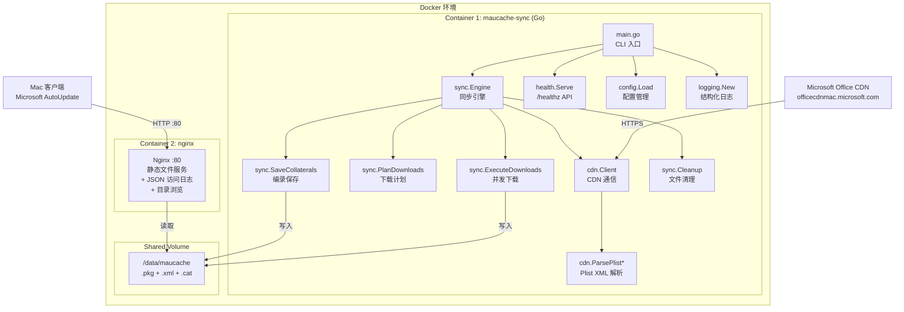
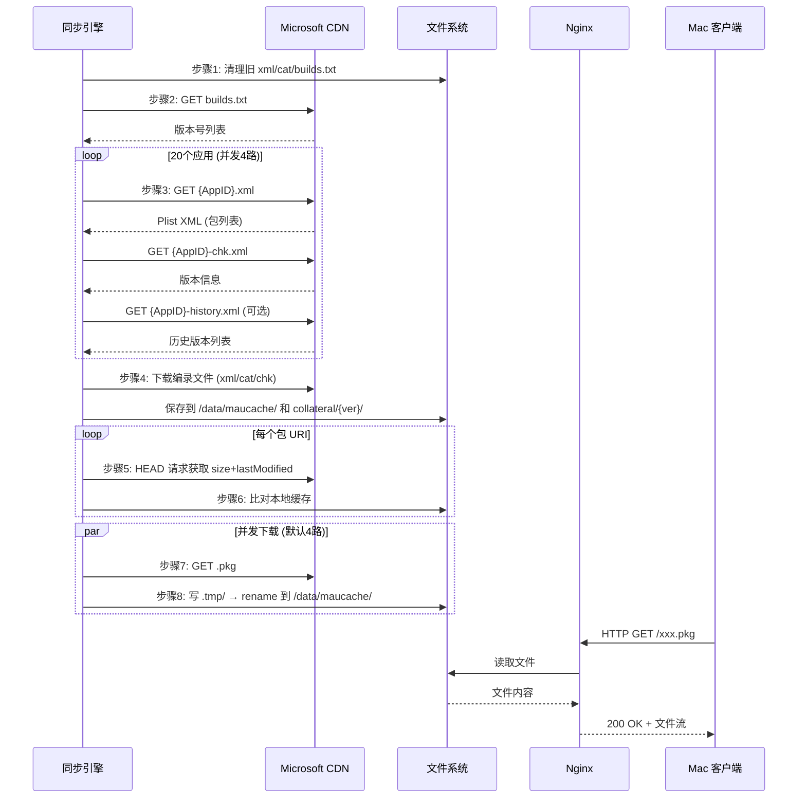
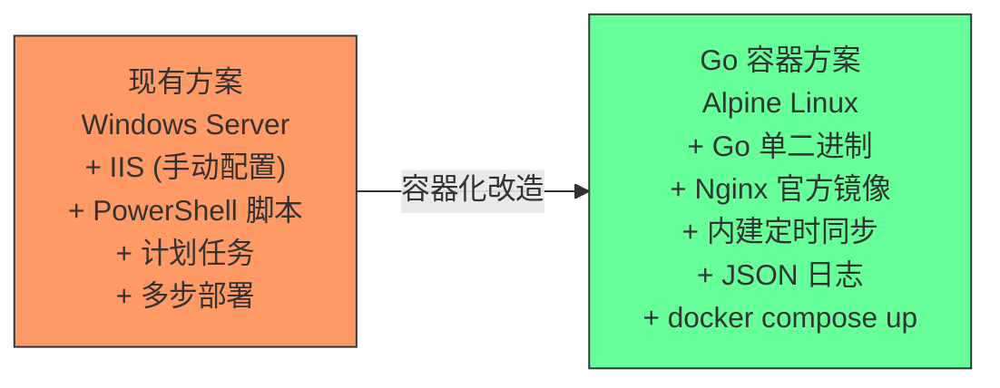

# MAUCacheAdmin Go 架构设计文档

> 版本：1.0  
> 日期：2026-02-16  
> 基于：PowerShell MAUCacheAdmin.Modify v1.0.8 → Go 容器化方案

---

## 1. 架构概览

### 1.1 整体架构图



### 1.2 数据流



---

## 2. 模块设计

### 2.1 模块依赖关系

```
cmd/maucache/main.go
    ├── internal/config      # 配置加载
    ├── internal/logging     # 日志初始化
    ├── internal/health      # 健康检查 API
    └── internal/sync        # 同步引擎
         ├── sync.go         # 主编排 (调用下面所有模块)
         ├── cleanup.go      # 文件清理
         ├── planner.go      # 下载计划
         ├── downloader.go   # 并发下载
         ├── collateral.go   # 编录保存
         └── internal/cdn    # CDN 通信层
              ├── client.go  # HTTP 客户端
              ├── builds.go  # builds.txt 获取
              ├── apps.go    # 应用清单获取
              └── plist.go   # Plist XML 解析
```

### 2.2 各模块职责

#### `cmd/maucache/main.go` — 入口

- 解析 CLI 参数（`--once` / `--config`）
- 加载配置、初始化日志
- 启动 Health API（后台 goroutine）
- 创建同步引擎并运行

对应 PowerShell: `MacUpdatesOffice.Modify.ps1` 的 `param` 块

#### `internal/config/config.go` — 配置管理

- 支持环境变量 + YAML 文件双重配置
- 环境变量优先，YAML 覆盖
- 所有配置有合理默认值

对应 PowerShell: `$workPath` / `$maupath` / `$mautemppath` 参数

#### `internal/cdn/client.go` — HTTP 客户端

- 全局复用的 `http.Client` 实例
- 内置连接池（`MaxIdleConns=20`）
- 提供 `GetString` / `GetStringOptional` / `Head` / `Download` 四个方法

对应 PowerShell: `Get-HttpClientHandler.ps1` + `Invoke-HttpClientDownload.ps1`

#### `internal/cdn/builds.go` — 构建版本获取

- 从 CDN 下载 `builds.txt`
- 解析为版本号字符串切片
- 处理 `\r\n` 和 `\n` 换行差异

对应 PowerShell: `Get-MAUProductionBuilds.ps1`

#### `internal/cdn/apps.go` — 应用清单获取

- 定义 20 个目标应用的 AppID/AppName
- 并发获取每个应用的 XML/ChkXml/HistoryXML
- 解析 Plist 提取包 URL 和版本信息
- 处理 `version=99999` 的特殊情况

对应 PowerShell: `Get-MAUApps.ps1` + `Get-MAUApp.ps1`

#### `internal/cdn/plist.go` — Plist XML 解析

- 使用 Go `encoding/xml` 标准库
- 支持 dict / array / string / integer / true / false 节点
- `ParsePlistPackages`: 从 AppID.xml 提取包 URL 列表
- `ParsePlistVersion`: 从 chk.xml 提取版本号
- `ParsePlistStringArray`: 从 history.xml 提取历史版本列表

对应 PowerShell: `ConvertFrom-Plist.ps1` + `ConvertFrom-AppPackageDictionary.ps1`

#### `internal/sync/sync.go` — 主流程编排

- `RunOnce()`: 执行一次完整同步（清理 → 获取版本 → 获取应用 → 保存编录 → 下载包）
- `RunLoop()`: 定时循环执行同步
- 记录同步状态到 Health Tracker

对应 PowerShell: `MacUpdatesOffice.Modify.ps1` 的完整流程

#### `internal/sync/planner.go` — 下载计划

- 收集所有包 URI
- 用 `builds.txt` 过滤 delta 包（正则匹配 `from_to` 模式）
- 对每个 URI 发 HEAD 请求获取元信息
- 与本地缓存比对，决定是否需要下载

对应 PowerShell: `Get-MAUCacheDownloadJobs.ps1`

#### `internal/sync/downloader.go` — 并发下载

- 使用 `errgroup` 限制并发数
- 先下载到 scratch 临时目录
- 完成后 `os.Rename` 原子移动到缓存目录
- 指数退避重试（2^n × retryDelay）
- 下载失败不阻塞其他任务

对应 PowerShell: `Invoke-MAUCacheDownload.ps1` + `Invoke-HttpClientDownload.ps1`

#### `internal/sync/collateral.go` — 编录文件保存

- `isProd=true`: 保存到缓存根目录 + 带版本号的文件
- `isProd=false`: 保存到 `collateral/{version}/` 子目录
- 统一了 `Save-MAUCollaterals` 和 `Save-oldMAUCollaterals` 的逻辑

#### `internal/sync/cleanup.go` — 文件清理

- 删除废弃的命名文件（Lync、Teams 等）
- 仅在根目录删除 xml/cat/builds.txt（不递归进 collateral）
- 清理 scratch 临时目录残留

#### `internal/health/health.go` — 健康检查

- `/healthz`: Docker/K8s 存活检查
- `/sync/status`: 同步状态查询（运行中/上次结果/耗时）

#### `internal/logging/logging.go` — 日志

- 基于 Go 1.21+ `log/slog`
- 支持 JSON 和 Text 两种格式
- 支持 debug/info/warn/error 级别

---

## 3. 关键设计决策

### 3.1 双容器架构

```
Go 同步引擎 (Container 1)     Nginx 文件服务 (Container 2)
┌─────────────────────┐      ┌─────────────────────┐
│ 定时从 CDN 下载      │      │ 静态文件服务 :80     │
│ 写入 /data/maucache  │ ───→ │ 读取 /data/maucache  │
│ :8080 管理 API       │      │ JSON 访问日志         │
└─────────────────────┘      └─────────────────────┘
          ↑                            ↑
    共享 Volume: maucache         共享 Volume: maucache (只读)
```

**设计理由**：
- 关注点分离：同步引擎负责写入，Nginx 负责读取和对外服务
- 独立升级：可以单独升级 Nginx 版本而不影响同步逻辑
- 故障隔离：同步引擎崩溃不影响文件服务

### 3.2 原子文件写入

```
1. 下载到临时文件:  /data/maucache/.tmp/xxx.pkg
2. 下载完成后:      os.Rename → /data/maucache/xxx.pkg
```

`os.Rename` 在同一文件系统内是原子操作，Nginx 要么看到旧文件，要么看到新文件，不会看到半成品。

### 3.3 并发控制

- 使用 `golang.org/x/sync/errgroup` 管理并发下载
- 默认并发数 4（可配置），避免 CDN 限流
- 每个 goroutine 独立重试，失败不阻塞其他下载

### 3.4 配置优先级

```
环境变量 (最高优先级)
    ↓ 覆盖
YAML 配置文件
    ↓ 覆盖
代码内默认值 (最低优先级)
```

---

## 4. 目录结构

```
GO/
├── cmd/
│   └── maucache/
│       └── main.go              # 入口
│
├── internal/
│   ├── config/
│   │   └── config.go            # 配置管理
│   │
│   ├── cdn/
│   │   ├── client.go            # HTTP 客户端
│   │   ├── builds.go            # builds.txt 获取
│   │   ├── apps.go              # 应用清单获取
│   │   ├── plist.go             # Plist XML 解析
│   │   └── plist_test.go        # 解析器测试
│   │
│   ├── sync/
│   │   ├── sync.go              # 主流程编排
│   │   ├── planner.go           # 下载计划
│   │   ├── downloader.go        # 并发下载
│   │   ├── collateral.go        # 编录保存
│   │   └── cleanup.go           # 文件清理
│   │
│   ├── health/
│   │   └── health.go            # 健康检查 API
│   │
│   └── logging/
│       └── logging.go           # 结构化日志
│
├── docker/
│   ├── Dockerfile               # 多阶段构建 (~25MB)
│   ├── docker-compose.yaml      # 双容器编排
│   └── nginx.conf               # 替代 IIS 配置
│
├── go.mod                       # 模块定义
├── go.sum                       # 依赖校验
├── 详细记录.md                   # 改造详细记录
├── go架构设计.md                 # 本文件
└── GO语言重置.md                 # 原始参考文档
```

---

## 5. 外部依赖

| 依赖 | 版本 | 用途 |
|------|------|------|
| `golang.org/x/sync` | v0.10.0 | `errgroup` 并发控制 |
| `gopkg.in/yaml.v3` | v3.0.1 | YAML 配置文件解析 |

仅 2 个外部依赖，其余全部使用 Go 标准库。

---

## 6. 20 个目标应用

Go 版本保持与 PowerShell 完全一致的 20 个目标应用：

| # | AppID | 应用名称 |
|---|-------|---------|
| 1 | 0409MSau04 | MAU 4.x |
| 2 | 0409MSWD2019 | Word 365/2021/2019 |
| 3 | 0409XCEL2019 | Excel 365/2021/2019 |
| 4 | 0409PPT32019 | PowerPoint 365/2021/2019 |
| 5 | 0409OPIM2019 | Outlook 365/2021/2019 |
| 6 | 0409ONMC2019 | OneNote 365/2021/2019 |
| 7 | 0409MSWD15 | Word 2016 |
| 8 | 0409XCEL15 | Excel 2016 |
| 9 | 0409PPT315 | PowerPoint 2016 |
| 10 | 0409OPIM15 | Outlook 2016 |
| 11 | 0409ONMC15 | OneNote 2016 |
| 12 | 0409MSFB16 | Skype for Business |
| 13 | 0409IMCP01 | Intune Company Portal |
| 14 | 0409MSRD10 | Remote Desktop v10 |
| 15 | 0409ONDR18 | OneDrive |
| 16 | 0409WDAV00 | Defender ATP |
| 17 | 0409EDGE01 | Edge |
| 18 | 0409TEAMS10 | Teams 1.0 classic |
| 19 | 0409TEAMS21 | Teams 2.1 |
| 20 | 0409OLIC02 | Office Licensing Helper |

---

## 7. 配置参考

### 7.1 环境变量

| 变量名 | 默认值 | 说明 |
|--------|--------|------|
| `MAUCACHE_SYNC_CHANNEL` | `Production` | 更新频道: Production / Preview / Beta |
| `MAUCACHE_SYNC_INTERVAL` | `6h` | 同步间隔 |
| `MAUCACHE_SYNC_CONCURRENCY` | `4` | 并发下载数 |
| `MAUCACHE_SYNC_RETRY_MAX` | `3` | 最大重试次数 |
| `MAUCACHE_SYNC_RETRY_DELAY` | `5s` | 重试退避基数 |
| `MAUCACHE_CACHE_DIR` | `/data/maucache` | 缓存存储目录 |
| `MAUCACHE_SCRATCH_DIR` | `/data/maucache/.tmp` | 临时下载目录 |
| `MAUCACHE_LOG_LEVEL` | `info` | 日志级别: debug/info/warn/error |
| `MAUCACHE_LOG_FORMAT` | `json` | 日志格式: json/text |
| `MAUCACHE_HEALTH_LISTEN` | `:8080` | 健康检查 API 监听地址 |

### 7.2 YAML 配置文件（可选）

```yaml
sync:
  channel: Production
  interval: 6h
  concurrency: 4
  retry_max: 3
  retry_delay: 5s

storage:
  cache_dir: /data/maucache
  scratch_dir: /data/maucache/.tmp

logging:
  level: info
  format: json

health:
  listen: ":8080"
```

---

## 8. API 端点

| 端点 | 方法 | 说明 | 响应示例 |
|------|------|------|---------|
| `/healthz` | GET | 健康检查 | `{"status":"ok"}` |
| `/sync/status` | GET | 同步状态 | `{"running":false,"last_sync":"...","downloaded":42,"skipped":85,"failed":0,"duration":"3m25s"}` |

---

## 9. 部署架构对比



| 维度 | 现有 PowerShell 方案 | Go 容器方案 |
|------|---------------------|------------|
| 部署 | 多步配置 (IIS+计划任务+脚本) | `docker compose up -d` |
| 操作系统 | 仅 Windows Server | 任意 (Linux/Windows/macOS) |
| 镜像大小 | N/A (宿主安装) | ~25MB (sync) + ~45MB (nginx) |
| 内存占用 | PowerShell ~200MB + IIS | Go ~50MB + Nginx ~10MB |
| 下载模式 | 串行 | 并发 (默认4路) |
| 日志 | IIS W3C 文件 | JSON stdout + `docker logs` |
| 重试机制 | 有缺陷(P1/P8) | 指数退避，可配置次数 |
| 健康检查 | 无 | /healthz + /sync/status |
