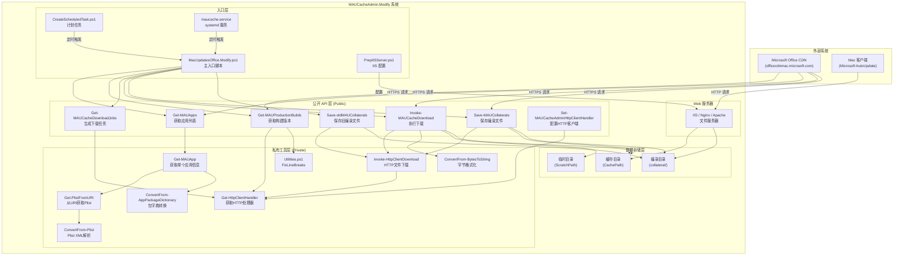
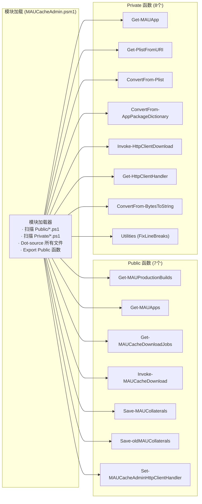
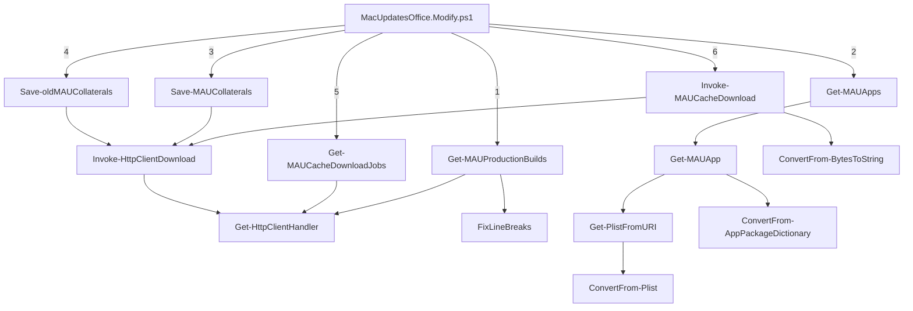
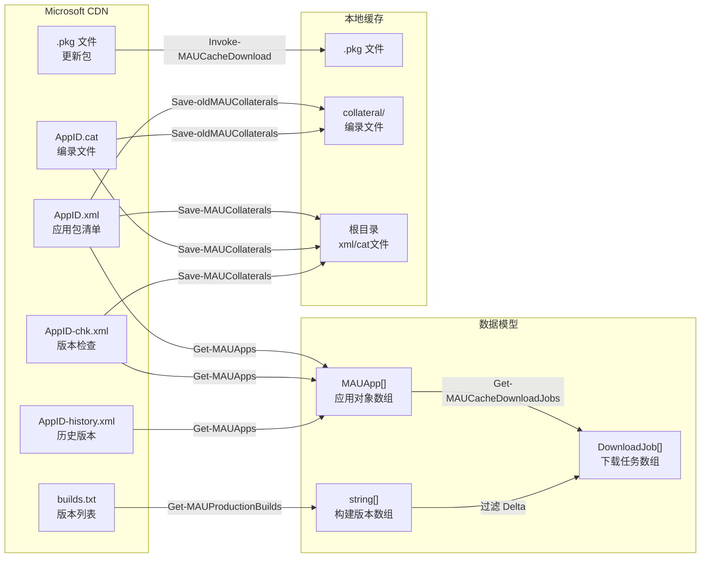
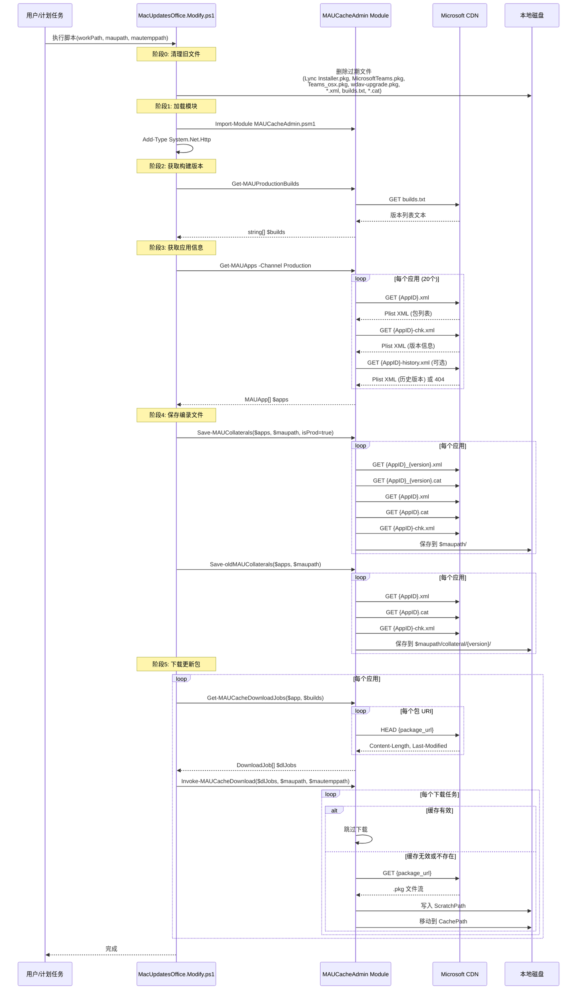
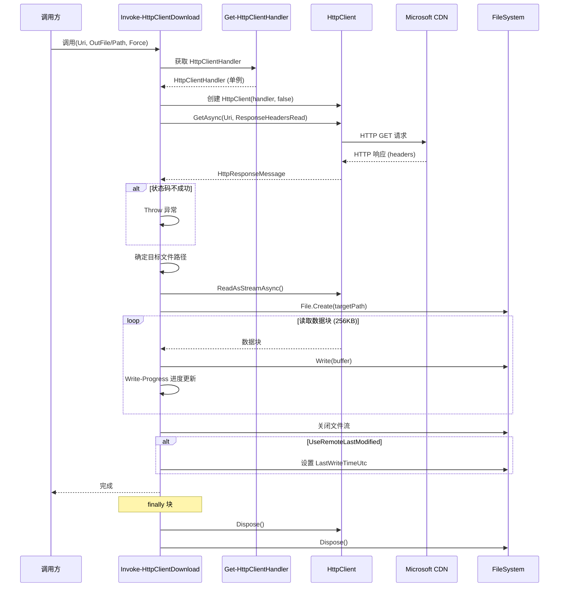
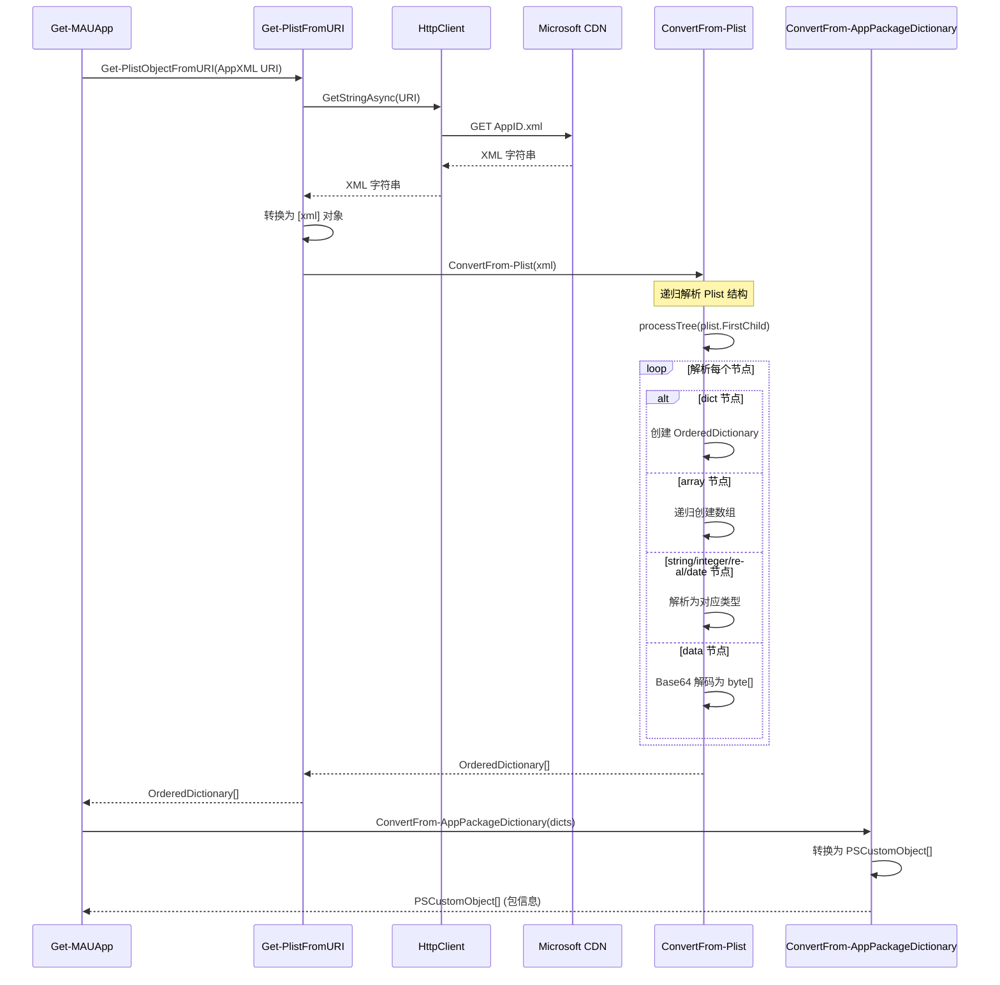
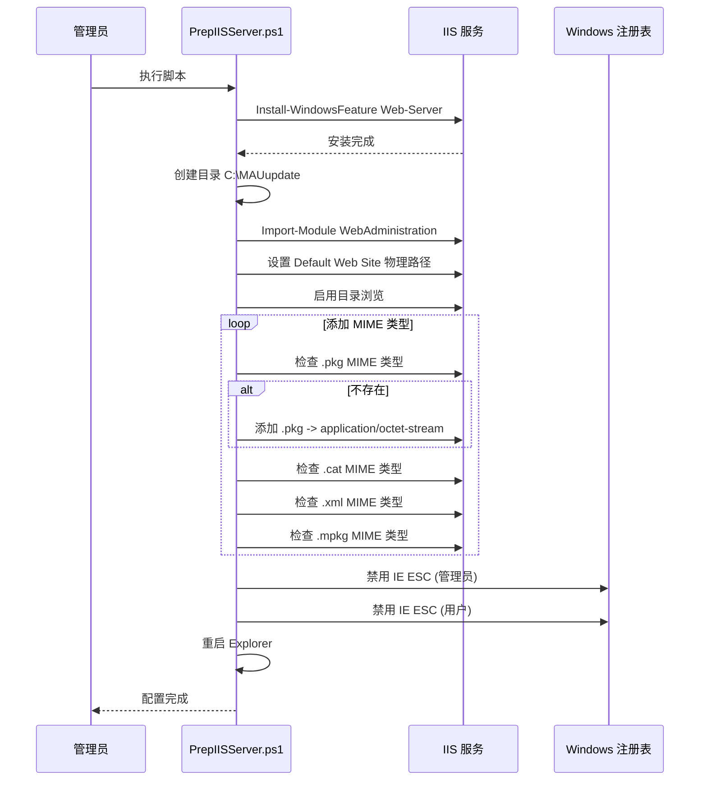

# MAUCacheAdmin.Modify 代码架构审查报告

> 审查日期：2026-02-16  
> 项目来源：基于 [pbowden-msft/MAUCacheAdmin](https://github.com/pbowden-msft/MAUCacheAdmin) 的修改版本  
> 语言/框架：PowerShell 5.1+ / PowerShell Core 兼容

---

## 目录

1. [项目概述](#1-项目概述)
2. [目录结构](#2-目录结构)
3. [架构设计](#3-架构设计)
4. [时序图](#4-时序图)
5. [模块详细说明](#5-模块详细说明)
6. [功能正常性评估](#6-功能正常性评估)
7. [已发现问题与风险](#7-已发现问题与风险)
8. [改进意见](#8-改进意见)
9. [功能新增建议](#9-功能新增建议)
10. [总结](#10-总结)

---

## 1. 项目概述

MAUCacheAdmin.Modify 是一个 PowerShell 工具集，用于管理 **Microsoft AutoUpdate (MAU)** 的本地缓存服务器。它从 Microsoft Office CDN 下载 macOS 版 Office 应用程序的更新包（.pkg），并将其缓存到本地 IIS 或其他 Web 服务器上，使内网 Mac 客户端可以从本地服务器获取更新，而无需每台设备都直接从互联网下载。

### 主要功能

- 从 Microsoft CDN 获取 macOS Office 生产版本（Production）构建信息
- 解析 Plist XML 格式的应用清单文件
- 下载全量包和增量更新包（Delta）
- 保存编录文件（Collaterals：XML、CAT、CHK 文件）
- 自动清理过期文件
- 支持 IIS 服务器的自动配置
- 支持 Windows 计划任务和 Linux systemd 服务的自动部署

---

## 2. 目录结构

```
MAUCacheAdmin.Modify/
├── MacUpdatesOffice.Modify.ps1          # 主入口脚本
├── CreateScheduledTask.ps1               # Windows 计划任务创建脚本
├── PrepIISServer.ps1                     # IIS 服务器配置脚本
├── maucache.service                      # Linux systemd 服务配置
├── README.md                             # 项目说明文档
├── config_profile_examples/              # Mac 客户端配置示例
│   ├── com.microsoft.autoupdate2-prod.plist   # 生产环境客户端配置
│   └── com.microsoft.autoupdate2-test.plist   # 测试环境客户端配置
└── PSModule/                             # PowerShell 模块目录
    ├── MAUCacheAdmin.Tests.ps1           # Pester 单元测试
    └── MAUCacheAdmin/                    # 核心模块
        ├── MAUCacheAdmin.psd1            # 模块清单
        ├── MAUCacheAdmin.psm1            # 模块加载器
        ├── README.md                     # 模块说明文档
        ├── Public/                       # 公开函数（对外暴露的 API）
        │   ├── Get-MAUApps.ps1
        │   ├── Get-MAUCacheDownloadJobs.ps1
        │   ├── Get-MAUProductionBuilds.ps1
        │   ├── Invoke-MAUCacheDownload.ps1
        │   ├── Save-MAUCollaterals.ps1
        │   ├── Save-oldMAUCollaterals.ps1
        │   └── Set-MAUCacheAdminHttpClientHandler.ps1
        └── Private/                      # 私有函数（模块内部使用）
            ├── ConvertFrom-AppPackageDictionary.ps1
            ├── ConvertFrom-BytesToString.ps1
            ├── ConvertFrom-Plist.ps1
            ├── Get-HttpClientHandler.ps1
            ├── Get-MAUApp.ps1
            ├── Get-PlistFromURI.ps1
            ├── Invoke-HttpClientDownload.ps1
            └── Utilities.ps1
```

---

## 3. 架构设计

### 3.1 整体架构图



### 3.2 模块层次架构图



### 3.3 函数调用关系图



### 3.4 数据流架构图



---

## 4. 时序图

### 4.1 主流程时序图



### 4.2 HTTP 下载时序图



### 4.3 Plist 解析时序图



### 4.4 IIS 服务器配置时序图



---

## 5. 模块详细说明

### 5.1 入口脚本

#### MacUpdatesOffice.Modify.ps1

| 项目 | 说明 |
|------|------|
| 功能 | 主入口脚本，编排整个缓存更新流程 |
| 参数 | `$workPath`（工作路径）、`$maupath`（缓存路径）、`$mautemppath`（临时路径） |
| 流程 | 清理旧文件 → 加载模块 → 获取构建版本 → 获取应用信息 → 保存编录 → 下载更新包 |

### 5.2 Public 函数详细说明

#### Get-MAUProductionBuilds

| 项目 | 说明 |
|------|------|
| 功能 | 从 CDN 获取当前生产环境的构建版本列表 |
| 输入 | 无参数 |
| 输出 | `string[]` 版本号数组 |
| CDN 端点 | `https://officecdnmac.microsoft.com/.../builds.txt` |
| 依赖 | `Get-HttpClientHandler`、`FixLineBreaks` |

#### Get-MAUApps

| 项目 | 说明 |
|------|------|
| 功能 | 获取指定通道（Production/Preview/Beta）的所有应用信息 |
| 输入 | `$Channel` - 渠道名称（Production/Preview/Beta） |
| 输出 | `PSCustomObject[]` 应用对象数组 |
| 支持的应用 | MAU 4.x, Word, Excel, PowerPoint, Outlook, OneNote (365/2021/2019 & 2016), Skype for Business, Intune Company Portal, Remote Desktop v10, OneDrive, Defender ATP, Edge, Teams 1.0 classic, Teams 2.1, Office Licensing Helper（共20个） |
| 依赖 | `Get-MAUApp` → `Get-PlistFromURI` → `ConvertFrom-Plist` |

#### Get-MAUCacheDownloadJobs

| 项目 | 说明 |
|------|------|
| 功能 | 根据应用信息和构建版本，生成下载任务列表 |
| 输入 | `$MAUApps`（应用列表）、`$DeltaFromBuildLimiter`/`$DeltaToBuildLimiter`（版本过滤器）、`$IncludeHistoricDeltas`/`$IncludeHistoricVersions`（开关） |
| 输出 | `PSCustomObject[]` - 包含 AppName, LocationUri, Payload, SizeBytes, LastModified |
| 逻辑 | 收集所有包 URI → 应用过滤规则 → 对每个 URI 发送 HEAD 请求获取元信息 |

#### Invoke-MAUCacheDownload

| 项目 | 说明 |
|------|------|
| 功能 | 执行实际的文件下载操作 |
| 输入 | `$MAUCacheDownloadJobs`、`$CachePath`、`$ScratchPath`、`$Force`、`$Mirror`、`$CompareLastModified` |
| 逻辑 | 验证缓存有效性（文件存在 + 大小匹配 + 可选的修改时间匹配） → 无效则下载到 ScratchPath → 移动到 CachePath |
| 重试 | 对 "The response ended prematurely" 错误最多重试 2 次 |
| Mirror 模式 | 删除 CachePath 中不在下载任务列表中的多余文件 |

#### Save-MAUCollaterals

| 项目 | 说明 |
|------|------|
| 功能 | 保存编录文件（XML、CAT 等） |
| 输入 | `$MAUApps`、`$CachePath`、`$isProd` |
| 逻辑 | `isProd=true` 时保存到根目录；`isProd=false` 时保存到 `collateral/{version}/` 子目录 |
| 特殊处理 | 生成带版本号的 CAT 和 XML 文件 URI（如 `AppID_version.cat`） |

#### Save-oldMAUCollaterals

| 项目 | 说明 |
|------|------|
| 功能 | 保存旧版编录文件到 `collateral/{version}/` 子目录 |
| 输入 | `$MAUApps`、`$CachePath` |
| 逻辑 | 总是保存到 `collateral/{version}/` 目录下 |

#### Set-MAUCacheAdminHttpClientHandler

| 项目 | 说明 |
|------|------|
| 功能 | 允许注入自定义的 HttpClientHandler（例如配置代理） |
| 输入 | `$Handler` - System.Net.Http.HttpClientHandler 对象 |
| 作用域 | 设置到 `$Script:HttpClientHandler`，影响模块内所有后续 HTTP 请求 |

### 5.3 Private 函数详细说明

| 函数名 | 功能 | 关键细节 |
|--------|------|----------|
| `Get-MAUApp` | 获取单个应用的完整信息 | 处理 AppXML、ChkXml、HistoryXML，修复 version=99999 的情况 |
| `Get-PlistFromURI` | 从 URI 获取并解析 Plist | 支持 `$Optional` 参数处理可选资源的 404 情况 |
| `ConvertFrom-Plist` | XML Plist 转 PowerShell 对象 | 递归解析 dict/array/string/integer/real/date/data 类型 |
| `ConvertFrom-AppPackageDictionary` | OrderedDictionary 转 PSCustomObject | 简单的类型转换 |
| `Invoke-HttpClientDownload` | HTTP 文件下载 | 使用流式下载（256KB 缓冲区），支持进度条显示 |
| `Get-HttpClientHandler` | 获取/创建 HttpClientHandler 单例 | 延迟初始化模式 |
| `ConvertFrom-BytesToString` | 字节数格式化 | 支持 KB/MB/GB/TB/PB 单位 |
| `FixLineBreaks` | 修复换行符 | 区分 PS 5.x 和 PS 6.0+ 的正则处理差异 |

### 5.4 辅助脚本

| 脚本 | 功能 | 关键细节 |
|------|------|----------|
| `PrepIISServer.ps1` | 配置 Windows IIS 作为缓存服务器 | 安装 IIS、配置站点路径、启用目录浏览、添加 MIME 类型、禁用 IE ESC |
| `CreateScheduledTask.ps1` | 创建 Windows 计划任务 | 提供一次性和每周执行两种模式 |
| `maucache.service` | Linux systemd 服务配置 | 服务崩溃后 5 分钟自动重启，并发送邮件通知 |

---

## 6. 功能正常性评估

### 6.1 核心功能评估

| 功能 | 状态 | 说明 |
|------|------|------|
| 模块加载 | ✅ 正常 | PSM1 加载器使用标准的 Public/Private 模式 |
| CDN 通信 | ✅ 正常 | 使用 HttpClient，兼容 PS 5.1+ |
| Plist 解析 | ✅ 正常 | 完整支持 Plist XML 所有数据类型 |
| 版本获取 | ✅ 正常 | 从 builds.txt 正确解析版本列表 |
| 应用枚举 | ✅ 正常 | 覆盖 20 个 Office 应用 |
| 文件下载 | ⚠️ 部分正常 | 流式下载正常，但错误处理有改进空间 |
| 编录保存 | ✅ 正常 | 支持根目录和 collateral 子目录两种模式 |
| 缓存验证 | ✅ 正常 | 基于文件大小验证，可选修改时间验证 |
| IIS 配置 | ✅ 正常 | 自动化配置流程完整 |
| 计划任务 | ⚠️ 部分正常 | 脚本路径硬编码，灵活性不足 |

### 6.2 兼容性评估

| 平台 | 状态 | 说明 |
|------|------|------|
| Windows + PowerShell 5.1 | ✅ 已测试 | 需要手动加载 `System.Net.Http` |
| Windows + PowerShell 7.x | ✅ 已测试 | 原生支持 |
| macOS + PowerShell 7.x | ✅ 已测试 | 模块文档声明支持 |
| Linux + PowerShell 7.x | ⚠️ 部分支持 | systemd 服务配置存在，但路径使用反斜杠（Windows 风格） |

---

## 7. 已发现问题与风险

### 7.1 严重问题

#### P1: `Invoke-HttpClientDownload` 异常被静默吞噬

**文件**: `PSModule/MAUCacheAdmin/Private/Invoke-HttpClientDownload.ps1` 第 72-74 行

```powershell
catch {
    Write-Host "Not find $($Uri.OriginalString)" -ForegroundColor Yellow
}
```

**问题描述**: 所有下载异常（包括网络超时、权限问题、磁盘空间不足等）都被 catch 块捕获并仅输出一行 Write-Host 消息，不会向上抛出异常。这导致调用方 `Invoke-MAUCacheDownload` 中的重试逻辑（第 91-106 行）永远不会被触发。

**影响**: 下载失败时不会重试，也不会有明确的错误信息，难以定位问题。

**建议**: 区分可恢复和不可恢复错误，对可恢复错误抛出异常以触发重试。

#### P2: `CachePath` 验证逻辑不一致

**文件对比**:
- `Invoke-MAUCacheDownload.ps1` 第 25-26 行: `CachePath` 不存在时抛出异常
- `Save-MAUCollaterals.ps1` 第 21-28 行: `CachePath` 不存在时自动创建
- `Save-oldMAUCollaterals.ps1` 第 16-18 行: `CachePath` 不存在时抛出异常

**影响**: 同一个 `CachePath` 在不同函数中的处理方式不一致，可能导致使用者困惑。

#### P3: 主脚本中 `$maupath` 默认值与 README 不一致

**文件**: `MacUpdatesOffice.Modify.ps1` 第 5 行 vs `README.md` 第 51 行

- 脚本默认值: `C:\inetpub\wwwroot\maucache`
- README 文档: `C:\inetpub\wwwroot\maunew6`

**影响**: 用户可能被文档误导，使用错误的路径。

### 7.2 中等问题

#### P4: 文件清理操作在模块导入前执行，且使用递归删除

**文件**: `MacUpdatesOffice.Modify.ps1` 第 15-36 行

```powershell
$filesToDelete = @(
    "Lync Installer.pkg", "MicrosoftTeams.pkg", ...
    "*.xml", "builds.txt", "*.cat"
)
```

使用 `-Recurse` 参数在 `$maupath` 下递归删除所有匹配文件。`*.xml` 和 `*.cat` 这两个通配符模式会递归删除 `collateral/` 子目录下所有已缓存的编录文件。

**影响**: 每次运行时会删除之前保存的所有 collateral 文件，然后重新下载，增加不必要的网络负担和执行时间。

#### P5: HttpClient 生命周期管理问题

**文件**: 多处

- `Get-MAUApps.ps1`: 创建 HttpClient → 传递给 Get-MAUApp → Dispose
- `Get-MAUCacheDownloadJobs.ps1`: 创建 HttpClient → 使用 → Dispose
- `Invoke-HttpClientDownload.ps1`: 每次调用都创建新 HttpClient → 使用 → Dispose

HttpClient 的最佳实践是复用实例，频繁创建和销毁可能导致端口耗尽（Socket Exhaustion）。

#### P6: `CreateScheduledTask.ps1` 脚本路径硬编码

**文件**: `CreateScheduledTask.ps1`

```powershell
$workDir="c:"
$taskScriptPath = "$workDir\MAU.ps1"
```

硬编码路径 `c:\MAU.ps1`，但实际主脚本名为 `MacUpdatesOffice.Modify.ps1`，路径也不匹配。

#### P7: `PrepIISServer.ps1` 中 Web 站点路径与主脚本不一致

- PrepIISServer.ps1 设置站点路径为 `C:\MAUupdate`
- 主脚本默认缓存路径为 `C:\inetpub\wwwroot\maucache`

两者不一致，用户需要手动调整其中一个。

#### P8: 下载重试逻辑缺陷

**文件**: `Invoke-MAUCacheDownload.ps1` 第 90-106 行

```powershell
$dlAttempt = 0
while ($dlAttempt -lt 2) {
    try {
        Invoke-HttpClientDownload ...
        break
    }
    catch {
        ...
        $dlAttempt++
    }
}
```

由于 P1 中的问题（`Invoke-HttpClientDownload` 内部 catch 了所有异常），此重试逻辑实际上永远不会进入 catch 块。即使修复了 P1，重试次数仅为 2 次（实际只会重试 1 次后退出循环），且没有指数退避（exponential backoff）。

#### P9: `Save-MAUCollaterals` 中 URI 拼接逻辑脆弱

**文件**: `Save-MAUCollaterals.ps1` 第 47-54 行

```powershell
$originalUri = $mauApp.CollateralURIs.CAT.OriginalString
$lastSlashIndex = $originalUri.LastIndexOf('/')
$baseUri = $originalUri.Substring(0, $lastSlashIndex + 1)
$fileName = $originalUri.Substring($lastSlashIndex + 1)
$fileNameParts = $fileName -split '\.'
$newFileName = $fileNameParts[0] + "_" + $ver + "." + $fileNameParts[1]
```

使用字符串操作而非 URI 类方法来构建 URI，当文件名包含多个 `.` 或 URI 格式变化时可能产生错误。

### 7.3 轻微问题

#### P10: 模块清单 `RequiredAssemblies` 与主脚本重复加载

**文件**: `MAUCacheAdmin.psd1` 第 31 行 + `MacUpdatesOffice.Modify.ps1` 第 42 行

```powershell
# psd1
RequiredAssemblies = @("System.Net.Http")

# 主脚本
Add-Type -AssemblyName System.Net.Http
```

两处都加载了 `System.Net.Http`，虽然不会导致错误，但属于冗余。

#### P11: `$builds` 变量未被使用的性能开销

**文件**: `MacUpdatesOffice.Modify.ps1` 第 45-57 行

`$builds = Get-MAUProductionBuilds` 获取了构建版本，然后在循环中使用。但循环是对每个 app 单独调用 `Get-MAUCacheDownloadJobs`，每次都创建新的 HttpClient 并发送 HEAD 请求，无法共享连接。

#### P12: 进度条 ID 冲突

`Get-MAUCacheDownloadJobs` 使用 `-Id 0` 和 `-Id 1`，`Get-MAUApps` 也使用 `-Id 0`，当嵌套调用时可能导致进度条显示混乱。

#### P13: 错误消息语法问题

**文件**: `Invoke-HttpClientDownload.ps1` 第 73 行

```powershell
Write-Host "Not find $($Uri.OriginalString)" -ForegroundColor Yellow
```

应为 "Not found" 或 "Cannot find"。

#### P14: 测试文件中存在变量名错误

**文件**: `PSModule/MAUCacheAdmin.Tests.ps1` 第 23 行

```powershell
Write-Debug "Debug $($script.Count)"
```

应为 `$scripts.Count`（缺少 s）。

---

## 8. 改进意见

### 8.1 高优先级改进

#### M1: 修复 `Invoke-HttpClientDownload` 的错误处理

```powershell
# 当前代码
catch {
    Write-Host "Not find $($Uri.OriginalString)" -ForegroundColor Yellow
}

# 建议改为
catch {
    Write-Warning "Failed to download $($Uri.OriginalString): $($_.Exception.Message)"
    throw  # 向上抛出异常，让调用方决定如何处理
}
```

#### M2: 统一 `CachePath` 验证逻辑

建议统一使用"不存在则自动创建"的模式：

```powershell
if (-not (Test-Path -Path $CachePath)) {
    New-Item -ItemType Directory -Path $CachePath -Force | Out-Null
    Write-Verbose "Created cache directory: $CachePath"
}
```

#### M3: 修复 README 中的默认值描述

将 README 中的 `C:\inetpub\wwwroot\maunew6` 更新为与脚本一致的 `C:\inetpub\wwwroot\maucache`。

#### M4: 优化文件清理逻辑

将 `*.xml` 和 `*.cat` 的递归删除限制为根目录，避免删除 `collateral/` 子目录中的文件：

```powershell
# 仅删除根目录下的 xml 和 cat，不递归
$rootOnlyPatterns = @("*.xml", "*.cat")
$recursivePatterns = @("Lync Installer.pkg", "MicrosoftTeams.pkg", ...)

foreach ($pattern in $rootOnlyPatterns) {
    Get-ChildItem -Path $maupath -Filter $pattern -File | Remove-Item -Force
}
foreach ($pattern in $recursivePatterns) {
    Get-ChildItem -Path $maupath -Filter $pattern -Recurse | Remove-Item -Force
}
```

### 8.2 中优先级改进

#### M5: 优化 HttpClient 生命周期

使用 `IHttpClientFactory` 模式或至少在模块级别复用 HttpClient：

```powershell
# 在模块作用域维护 HttpClient 单例
function Get-MAUHttpClient {
    if ($null -eq $Script:HttpClient) {
        $Script:HttpClient = [System.Net.Http.HttpClient]::new((Get-HttpClientHandler), $false)
        $Script:HttpClient.Timeout = [TimeSpan]::FromMinutes(30)
    }
    return $Script:HttpClient
}
```

#### M6: 参数化 `CreateScheduledTask.ps1`

```powershell
param(
    [string]$TaskScriptPath = "C:\MAUCacheAdmin.Modify-main\MacUpdatesOffice.Modify.ps1",
    [string]$TaskName = "MAU Cache Update",
    [ValidateSet("Once","Weekly")]
    [string]$Schedule = "Weekly",
    [string]$DayOfWeek = "Saturday",
    [string]$Time = "01:00"
)
```

#### M7: 统一 `PrepIISServer.ps1` 与主脚本的默认路径

将 `PrepIISServer.ps1` 的站点路径参数化，并使用与主脚本一致的默认值：

```powershell
param(
    [string]$SitePath = "C:\inetpub\wwwroot\maucache"
)
```

#### M8: 增强下载重试逻辑

```powershell
$maxRetries = 3
$dlAttempt = 0
while ($dlAttempt -lt $maxRetries) {
    try {
        Invoke-HttpClientDownload -Uri $dlJob.LocationUri -OutFile $targetScratchItem.FullName -UseRemoteLastModified -Force
        break
    }
    catch {
        $dlAttempt++
        if ($dlAttempt -ge $maxRetries) { throw }
        $backoffSeconds = [Math]::Pow(2, $dlAttempt) * 5
        Write-Warning "Download failed (attempt $dlAttempt/$maxRetries), retrying in $backoffSeconds seconds..."
        Start-Sleep -Seconds $backoffSeconds
    }
}
```

#### M9: 使用 URI 类方法构建编录文件 URI

```powershell
$baseUri = [Uri]::new($mauApp.CollateralURIs.CAT, ".")
$catFileName = [System.IO.Path]::GetFileNameWithoutExtension($mauApp.CollateralURIs.CAT.Segments[-1])
$catExtension = [System.IO.Path]::GetExtension($mauApp.CollateralURIs.CAT.Segments[-1])
$versionedCatUri = [Uri]::new($baseUri, "${catFileName}_${ver}${catExtension}")
```

### 8.3 低优先级改进

#### M10: 添加日志记录功能

建议添加结构化日志功能，支持输出到文件：

```powershell
function Write-MAULog {
    param(
        [string]$Message,
        [ValidateSet("Info","Warning","Error")]
        [string]$Level = "Info"
    )
    $timestamp = Get-Date -Format "yyyy-MM-dd HH:mm:ss"
    $logEntry = "[$timestamp] [$Level] $Message"
    Add-Content -Path $Script:LogPath -Value $logEntry
    switch ($Level) {
        "Warning" { Write-Warning $Message }
        "Error" { Write-Error $Message }
        default { Write-Verbose $Message }
    }
}
```

#### M11: 添加校验和验证

下载后对文件进行哈希校验（如果 CDN 提供了校验信息）：

```powershell
$expectedHash = $dlJob.Hash  # 如果可用
if ($expectedHash) {
    $actualHash = (Get-FileHash -Path $targetPath -Algorithm SHA256).Hash
    if ($actualHash -ne $expectedHash) {
        throw "Hash mismatch for $($dlJob.Payload)"
    }
}
```

#### M12: 修复测试文件中的变量名错误

```powershell
# 修复
Write-Debug "Debug $($scripts.Count)"
```

---

## 9. 功能新增建议

### 9.1 并行下载支持

**需求**: 当前下载逻辑为串行（ForEach-Object 同步），对于大量文件下载效率低下。

**建议**: 使用 PowerShell 7 的 `ForEach-Object -Parallel` 或 `Start-Job` 实现并行下载：

```powershell
# PowerShell 7+ 版本
$apps | ForEach-Object -Parallel {
    $dlJobs = Get-MAUCacheDownloadJobs -MAUApps $_ -DeltaFromBuildLimiter $using:builds
    Invoke-MAUCacheDownload -MAUCacheDownloadJobs $dlJobs -CachePath $using:maupath -ScratchPath $using:mautemppath -Force
} -ThrottleLimit 4
```

### 9.2 增量更新检测

**需求**: 当前每次运行都会删除所有 XML 和 CAT 文件并重新下载。

**建议**: 仅在版本发生变化时才重新下载编录文件：

```powershell
function Test-MAUCacheUpToDate {
    param($CachePath, $MAUApps)
    
    $versionFile = Join-Path $CachePath ".mau-cache-version"
    if (-not (Test-Path $versionFile)) { return $false }
    
    $cached = Get-Content $versionFile | ConvertFrom-Json
    $current = $MAUApps | ForEach-Object { @{AppID=$_.AppID; Version=$_.VersionInfo.Version} }
    
    return ($cached | ConvertTo-Json) -eq ($current | ConvertTo-Json)
}
```

### 9.3 邮件/Webhook 通知

**需求**: 缓存更新完成或失败时通知管理员。

**建议**:

```powershell
function Send-MAUNotification {
    param(
        [string]$Subject,
        [string]$Body,
        [ValidateSet("Email","Teams","Slack")]
        [string]$Method = "Email"
    )
    
    switch ($Method) {
        "Email" {
            Send-MailMessage -To $Config.NotifyEmail -Subject $Subject -Body $Body -SmtpServer $Config.SmtpServer
        }
        "Teams" {
            $payload = @{ text = "$Subject`n$Body" } | ConvertTo-Json
            Invoke-RestMethod -Uri $Config.TeamsWebhook -Method Post -Body $payload -ContentType "application/json"
        }
    }
}
```

### 9.4 配置文件支持

**需求**: 将硬编码参数外部化为配置文件。

**建议**: 支持 JSON 配置文件：

```json
{
    "workPath": "C:\\MAUCacheAdmin.Modify-main",
    "cachePath": "C:\\inetpub\\wwwroot\\maucache",
    "scratchPath": "C:\\MAUCacheAdmin.Modify-main\\temp",
    "channel": "Production",
    "maxRetries": 3,
    "parallelDownloads": 4,
    "notification": {
        "enabled": true,
        "method": "Email",
        "recipients": ["admin@example.com"]
    },
    "excludeApps": ["0409MSFB16"],
    "includeHistoricDeltas": false
}
```

### 9.5 缓存清理策略

**需求**: 自动清理超过一定时间的旧版本缓存文件。

**建议**:

```powershell
function Invoke-MAUCacheCleanup {
    param(
        [string]$CachePath,
        [int]$RetentionDays = 90
    )
    
    $threshold = (Get-Date).AddDays(-$RetentionDays)
    $oldFiles = Get-ChildItem -Path $CachePath -Recurse -File | Where-Object { $_.LastWriteTime -lt $threshold }
    
    Write-Host "Found $($oldFiles.Count) files older than $RetentionDays days"
    $oldFiles | Remove-Item -Force -WhatIf  # 先预览
}
```

### 9.6 健康检查端点

**需求**: 为缓存服务器提供健康检查接口。

**建议**: 生成一个状态 JSON 文件，可被监控系统轮询：

```powershell
function Update-MAUCacheStatus {
    param($CachePath, $MAUApps)
    
    $status = @{
        lastUpdate = (Get-Date).ToString("o")
        appCount = $MAUApps.Count
        totalFiles = (Get-ChildItem $CachePath -Recurse -File).Count
        totalSize = (Get-ChildItem $CachePath -Recurse -File | Measure-Object Length -Sum).Sum
        apps = $MAUApps | ForEach-Object { @{name=$_.AppName; version=$_.VersionInfo.Version} }
    }
    
    $status | ConvertTo-Json -Depth 3 | Set-Content (Join-Path $CachePath "status.json")
}
```

### 9.7 支持选择性应用下载

**需求**: 允许用户仅下载特定应用的更新（如仅下载 Word 和 Excel）。

**建议**:

```powershell
param(
    [string[]]$IncludeApps,   # 如 @("Word", "Excel")
    [string[]]$ExcludeApps    # 如 @("Skype for Business", "Teams 1.0 classic")
)
```

### 9.8 带宽限制

**需求**: 在共享网络环境中避免下载占用过多带宽。

**建议**: 在 `Invoke-HttpClientDownload` 中实现速率限制：

```powershell
param(
    [int]$MaxBytesPerSecond = 0  # 0 = 无限制
)

# 在读取循环中加入延迟
if ($MaxBytesPerSecond -gt 0) {
    $elapsed = [DateTime]::Now - $downloadStart
    $expectedTime = $totalBytesRead / $MaxBytesPerSecond
    if ($expectedTime -gt $elapsed.TotalSeconds) {
        Start-Sleep -Milliseconds (($expectedTime - $elapsed.TotalSeconds) * 1000)
    }
}
```

### 9.9 Docker 容器化支持

**需求**: 使用容器化部署简化服务器配置。

**建议**: 创建 Dockerfile：

```dockerfile
FROM mcr.microsoft.com/powershell:latest
RUN apt-get update && apt-get install -y nginx
COPY . /app/MAUCacheAdmin
COPY nginx.conf /etc/nginx/nginx.conf
VOLUME /cache
EXPOSE 80
CMD ["pwsh", "-File", "/app/MAUCacheAdmin/MacUpdatesOffice.Modify.ps1", "-maupath", "/cache"]
```

### 9.10 缓存统计报告

**需求**: 提供缓存使用情况的统计报告。

**建议**:

```powershell
function Get-MAUCacheReport {
    param([string]$CachePath)
    
    $files = Get-ChildItem -Path $CachePath -Recurse -File
    
    return [PSCustomObject]@{
        TotalFiles = $files.Count
        TotalSize = ConvertFrom-BytesToString ($files | Measure-Object Length -Sum).Sum
        PkgFiles = ($files | Where-Object Extension -eq '.pkg').Count
        XmlFiles = ($files | Where-Object Extension -eq '.xml').Count
        CatFiles = ($files | Where-Object Extension -eq '.cat').Count
        OldestFile = ($files | Sort-Object LastWriteTime | Select-Object -First 1).LastWriteTime
        NewestFile = ($files | Sort-Object LastWriteTime -Descending | Select-Object -First 1).LastWriteTime
    }
}
```

---

## 10. 总结

### 整体评价

MAUCacheAdmin.Modify 是一个功能基本完整的 Microsoft AutoUpdate 缓存管理工具。代码结构清晰，采用了 PowerShell 模块化的最佳实践（Public/Private 分层），核心功能（CDN 通信、Plist 解析、文件下载）实现可靠。

### 关键风险优先级

| 优先级 | 编号 | 问题 | 建议 |
|--------|------|------|------|
| 🔴 高 | P1 | 下载异常被静默吞噬 | 修复 catch 块，向上抛出异常 |
| 🔴 高 | P4 | 递归删除 `*.xml`/`*.cat` 影响 collateral | 限制删除范围 |
| 🟡 中 | P2 | CachePath 验证不一致 | 统一行为 |
| 🟡 中 | P3 | README 默认值不一致 | 更新文档 |
| 🟡 中 | P5 | HttpClient 频繁创建/销毁 | 复用实例 |
| 🟡 中 | P6 | 计划任务路径硬编码 | 参数化 |
| 🟡 中 | P7 | IIS 路径与主脚本不一致 | 统一默认值 |
| 🟡 中 | P8 | 重试逻辑无法触发 | 依赖 P1 修复 |
| 🟢 低 | P9-P14 | URI拼接/冗余加载/测试错误等 | 逐步修复 |

### 功能新增优先级建议

| 优先级 | 功能 | 价值 |
|--------|------|------|
| 🔴 高 | 并行下载支持 | 显著提升更新速度 |
| 🔴 高 | 配置文件支持 | 提升可维护性和部署灵活性 |
| 🟡 中 | 邮件/Webhook 通知 | 提升运维可观测性 |
| 🟡 中 | 增量更新检测 | 减少不必要的网络请求 |
| 🟡 中 | 选择性应用下载 | 满足不同场景需求 |
| 🟡 中 | 缓存清理策略 | 自动化磁盘空间管理 |
| 🟢 低 | 健康检查端点 | 便于监控集成 |
| 🟢 低 | 缓存统计报告 | 便于运维管理 |
| 🟢 低 | 带宽限制 | 适用于共享网络环境 |
| 🟢 低 | Docker 容器化 | 简化部署 |
